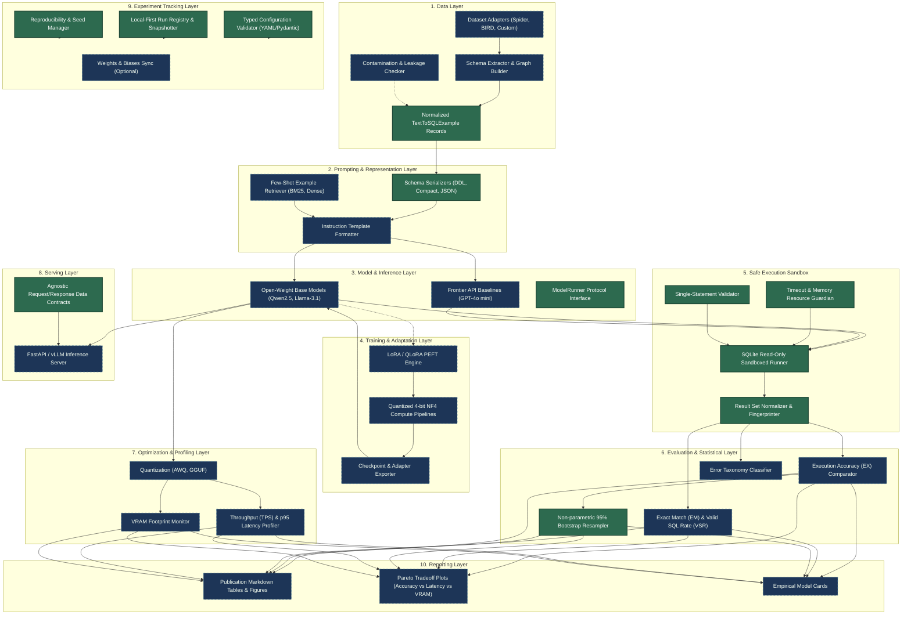

# SQLForge System Architecture Specification

## 1. Executive Overview

SQLForge is an empirical research framework and evaluation pipeline designed to conduct a controlled, reproducible scientific investigation into what fine-tuning smaller open-weight language models actually achieves on text-to-SQL compared to frontier API references, zero-shot prompting, and few-shot in-context learning.

The architecture emphasizes:
1. **Strict Decoupling:** Domain contracts (`schemas`), execution sandboxes (`execution`), training orchestration (`training`), and serving (`serving`) remain independent modules.
2. **Defensive SQL Execution:** Every generated query is treated as untrusted input and executed inside hardened, isolated, read-only sandboxes.
3. **Reproducibility by Design:** Configuration snapshots, random seeds, hardware/software environment fingerprints, and git commits are immutably logged for every run.
4. **Local-First Traceability:** Zero external cloud dependencies are required to inspect, run, validate, or record experiments.

---

## 2. End-to-End System Architecture

The following diagram illustrates the complete 10-layer architectural flow. Components marked **[Step 0 Implemented]** represent the foundational contracts, tooling, and local trackers established in this phase; components marked **[Planned: Steps 1–12]** represent downstream implementations.



---

## 3. Component Responsibilities

| Layer | Responsibility | Step 0 Status | Future Roadmap Target |
| :--- | :--- | :--- | :--- |
| **1. Data Layer** | Ingest raw benchmarks, extract database schemas, normalize into canonical `TextToSQLExample`, enforce split boundaries, run contamination checks. | Data contracts defined (`SchemaMetadata`, `TextToSQLExample`). | Step 1 & Step 2 |
| **2. Prompting Layer** | Serialize schemas into DDL / compact representations, retrieve few-shot demonstration pairs, format instruction prompts. | Contract protocols defined (`SchemaSerializer`). | Step 3 |
| **3. Model Layer** | Abstraction over local Hugging Face causal models, LoRA-adapted weights, and external commercial API endpoints. | Contract protocols defined (`ModelRunner`). | Step 4 |
| **4. Training Layer** | Supervised fine-tuning orchestration using PEFT (LoRA/QLoRA), parameter scaling, learning rate schedules, and checkpoint management. | Config schemas defined (`TrainingParams`, `LoRAHyperparameters`). | Step 5 & Step 6 |
| **5. Execution Layer** | Sandboxed database execution harness. Enforces read-only permissions, query timeouts, memory limits, and single-statement rules. | Data contracts defined (`ExecutionResult`, `ExecutionStatus`). | Step 7 |
| **6. Evaluation Layer** | Computes Execution Accuracy (EX), Exact Match (EM), Valid-SQL Rate (VSR), parses execution errors, calculates 95% bootstrap confidence intervals. | Metrics models defined (`EvaluationMetrics`, `ConfidenceInterval`). | Step 8 |
| **7. Optimization Layer** | Benchmarks post-training quantization (AWQ, GGUF), profiles generation throughput (tokens/sec), p95 latency, and VRAM consumption. | Optimization protocols defined (`ModelOptimizer`). | Step 9 |
| **8. Serving Layer** | Exposes a lightweight production-grade inference API with framework-agnostic request and response contracts. | Typed request/response models (`TextToSQLRequest`, `TextToSQLResponse`). | Step 10 |
| **9. Experiment Layer** | Validates YAML experiment matrix against Pydantic schemas, logs execution snapshots, manages seeds, and ensures full local traceability. | Fully implemented (`ExperimentTracker`, `settings.py`, `reproducibility.py`). | Step 0 & Ongoing |
| **10. Reporting Layer** | Generates publication-ready comparative tables, Pareto trade-off curves, and reproducibility model cards. | Structure and report specs established in `reports/`. | Step 11 & Step 12 |

---

## 4. End-to-End Data Flow

The lifecycle of an experiment follows this deterministic progression:

```text
[YAML Experiment Config]
          │
          ▼ (Typed Validation)
[Resolved Config & Environment Hash Snapshot]
          │
          ▼
[Dataset Loading & Schema Extraction] ── (Leakage & Contamination Check)
          │
          ▼
[Prompt Assembly & Schema Serialization (DDL / Compact)]
          │
          ├────────────────────────┬────────────────────────┐
          ▼                        ▼                        ▼
[Zero-Shot Prompting]    [Few-Shot In-Context]    [Supervised Fine-Tuning]
(Open-Weight / API)       (BM25 / Embeddings)       (LoRA / QLoRA SFT)
          │                        │                        │
          └────────────────────────┼────────────────────────┘
                                   ▼
                         [SQL Query Generation]
                                   │
                                   ▼
                [Safe Execution Sandbox (Read-Only SQLite)]
                ├─ Single-statement validation
                ├─ Hard wall-clock timeout (10.0s)
                └─ Memory ceiling (1024 MB)
                                   │
                                   ▼
                   [Result Set Equivalence Check]
                   ├─ Set equality (order-insensitive default)
                   ├─ Float tolerance (1e-4)
                   └─ Result fingerprint hashing (SHA-256)
                                   │
                                   ▼
                [Statistical Aggregation & Resampling]
                ├─ Execution Accuracy (EX)
                ├─ 95% Bootstrap Confidence Intervals
                └─ Error Taxonomy Categorization
                                   │
                                   ▼
                     [Local Run Directory Artifacts]
                     artifacts/runs/<run_id>/
                     ├── config.yaml
                     ├── run_metadata.json
                     ├── metrics.json
                     └── generations.jsonl
```

---

## 5. Interface Boundaries & Dependency Direction

SQLForge enforces clean architectural boundaries:

1. **Domain Isolation:** `sqlforge.schemas` contains pure Pydantic v2 data models. It depends only on standard Python libraries and Pydantic—never on PyTorch, Hugging Face, SQLAlchemy, or FastAPI.
2. **Infrastructure Independence:** The experiment tracker (`sqlforge.experiments.tracker`) operates entirely on local disk files (JSON/YAML) and does not require active network connections or API tokens.
3. **Pluggable Execution Engines:** The execution layer is defined as an abstract Python protocol (`SQLExecutor`), allowing seamless swapping of SQLite, PostgreSQL, or DuckDB engines without modifying evaluation logic.

---

## 6. SQL Execution Security Boundaries

Generated SQL is untrusted code generated by statistical language models. SQLForge treats all query execution with strict defense-in-depth:

```text
┌─────────────────────────────────────────────────────────────┐
│                 Untrusted Model Generation                  │
└──────────────────────────────┬──────────────────────────────┘
                               │
                               ▼
┌─────────────────────────────────────────────────────────────┐
│ [Filter 1: Pre-Execution AST & Statement Boundary Gate]     │
│ - Strict single-statement enforcement (disallow semicolon)  │
│ - Syntax parse validation via dialect parser                │
└──────────────────────────────┬──────────────────────────────┘
                               │
                               ▼
┌─────────────────────────────────────────────────────────────┐
│ [Filter 2: Connection-Level Permissions Gate]               │
│ - Read-only URI mode: sqlite3.connect("file:...?mode=ro")   │
│ - Dedicated unprivileged database role without write grants │
└──────────────────────────────┬──────────────────────────────┘
                               │
                               ▼
┌─────────────────────────────────────────────────────────────┐
│ [Filter 3: Resource Quota & Process Isolation Gate]         │
│ - Hard wall-clock timeout (10.0s) via OS thread timer       │
│ - Max row limit truncation (5000 rows)                      │
│ - Memory allocation ceiling (1024 MB)                       │
│ - Target is strictly benchmark copy; never production DB    │
└─────────────────────────────────────────────────────────────┘
```

### Why Naive Regex Filtering is Rejected
SQLForge explicitly rejects regex string filters (such as `if "DROP" in sql: block()`) as a security guarantee. Attackers and hallucinating models can bypass naive regex filters through comments (`SEL/**/ECT`), case variations, obfuscated hex literals, or nested statements. True security is achieved through **immutable read-only connections, process limits, and database account isolation**.
