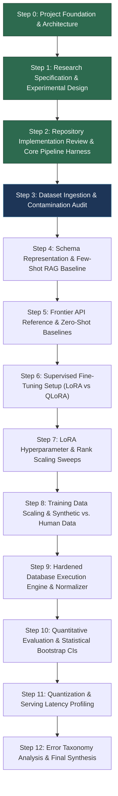

# SQLForge Step Dependencies & Execution Roadmap

This document formalizes the dependency graph, phase progression, exit criteria, and research risk mitigations across the 12-step SQLForge roadmap.

---

## 1. Roadmap Alignment & Canonical Progression

To harmonize the initial Step 0 conceptual outline with the rigorous research specifications established in Step 1, the canonical 12-step sequence is mapped as follows:

---

## 2. Step-by-Step Dependencies, Deliverables & Exit Criteria

### Step 0: Project Foundation & Architecture
* **Status:** Complete (Merged via PR #1).
* **Deliverables:** Package layout (`src/sqlforge/`), typed schemas, YAML configs, CLI tooling, PR/issue templates, ADRs 001–004.
* **Exit Criteria:** Package installable, CLI functioning, 26 unit/integration tests passing in CI.

### Step 1: Research Specification & Experimental Design
* **Status:** Complete (Merged via PR #2; remediated via PR #3).
* **Prerequisites:** Step 0 repository foundation.
* **Deliverables:** `docs/research/` specification suite (hypotheses with TOST equivalence bounds, baseline protocol, dataset governance protocol, complete 10-experiment matrix, metrics & statistics, error taxonomy, compute plan, experiment record spec, step dependencies).
* **Exit Criteria:** All 9 research documents complete, internally consistent, peer-reviewed, and merged via PR.

### Step 2: Repository Implementation Review & Core Pipeline Harness
* **Status:** Complete (Merged via PR #4; hardened via Step 2.1).
* **Prerequisites:** Step 1 research specification.
* **Deliverables:** Hardened `ExperimentTracker` with path traversal defense, atomic directory reservation, non-destructive anomaly logging, and strict cryptographic verification (`manifest.json`); deterministic fixture dataset (`mock_spider.json`); independent prompt builder; mock model runner; mock evaluator; pipeline orchestrator harness; and CLI subcommand `sqlforge pipeline mock`.
* **Exit Criteria:** Dry-run and complete offline end-to-end execution of mock pipeline vertical slice; 64 unit/integration tests passing in CI across Ubuntu/Windows.

### Step 3: Dataset Ingestion & Contamination Audit (Next Step)
* **Status:** Pending
* **Prerequisites:** Step 2 pipeline harness.
* **Deliverables:** Spider dataset ingest adapter, BIRD mini-dev adapter, custom held-out schema constructor, n-gram leakage checker, and SHA-256 data manifest.
* **Exit Criteria:** Zero leakage between train and dev/test partitions; schema disjointness verified mathematically.

### Step 4: Schema Representation & Few-Shot RAG Pipeline
* **Prerequisites:** Step 3 ingested datasets.
* **Deliverables:** DDL, compact pipe, and JSON schema serializers; BM25 training-example retriever; prompt formatting engine.
* **Exit Criteria:** Formatted prompts strictly adhere to context limits; retrieval index isolated to training partition.

### Step 5: Frontier API Reference & Zero-Shot Baselines
* **Prerequisites:** Step 4 prompting engine.
* **Deliverables:** Zero-shot and few-shot evaluation of Qwen2.5-Coder-1.5B, Qwen2.5-Coder-7B, and GPT-4o mini reference; cost tracking and rate limiting.
* **Exit Criteria:** Baseline metrics (`EXP-01`) recorded in `artifacts/runs/` with 95% bootstrap CIs.

### Step 6: Supervised Fine-Tuning Setup (LoRA vs. QLoRA)
* **Prerequisites:** Step 5 baselines.
* **Deliverables:** SFT fine-tuning pipeline with Hugging Face PEFT; 16-bit LoRA and 4-bit NF4 QLoRA execution on Spider train (`EXP-03`).
* **Exit Criteria:** Loss curves recorded, VRAM allocated monitored, checkpoints saved cleanly without base weight duplication.

### Step 7: LoRA Hyperparameter & Rank Scaling Sweeps
* **Prerequisites:** Step 6 fine-tuning setup.
* **Deliverables:** Systematic sweep over LoRA ranks $r \in \{8, 16, 32, 64\}$ and target modules (`EXP-04`).
* **Exit Criteria:** Rank saturation Pareto plot generated; optimal rank identified.

### Step 8: Training Data Scaling & Synthetic vs. Human Data
* **Prerequisites:** Step 7 optimal configuration.
* **Deliverables:** Sample scaling runs ($N \in \{500, 1000, 2000, 5000, 7000\}$) across 3 seeds (`EXP-05`); synthetic data comparison (`EXP-06`).
* **Exit Criteria:** Empirical scaling laws fitted; sample efficiency comparison documented.

### Step 9: Hardened Database Execution Engine & Normalizer
* **Prerequisites:** Step 3 databases.
* **Deliverables:** Read-only SQLite sandboxing engine, query timeout monitors, multiset result set normalizer, and cryptographic result fingerprinter.
* **Exit Criteria:** Safe execution of arbitrary generated SQL with zero data mutation and 100% timeout enforcement.

### Step 10: Quantitative Evaluation & Statistical Bootstrap CIs
* **Prerequisites:** Steps 6–9.
* **Deliverables:** Full execution accuracy evaluation across all model checkpoints, McNemar paired tests, and 95% bootstrap confidence intervals.
* **Exit Criteria:** Comprehensive evaluation tables partitioned by difficulty and schema domain.

### Step 11: Quantization & Serving Latency Profiling
* **Prerequisites:** Step 10 evaluated models.
* **Deliverables:** 4-bit post-training quantization (AWQ, GGUF); vLLM serving benchmark across concurrency levels 1, 8, 32 (`EXP-08`, `EXP-10`).
* **Exit Criteria:** Throughput (TPS/QPS) vs. p95 latency curves generated under realistic client load.

### Step 12: Error Taxonomy Analysis & Final Synthesis
* **Prerequisites:** Steps 10–11.
* **Deliverables:** 10-category error classification breakdown, qualitative analysis of failure modes, final comparative research paper/report, and public model card.
* **Exit Criteria:** Complete research narrative finalized; reproducible open-source release bundle ready.

---

## 3. Major Research Risks & Mitigations

| Risk Description | Probability | Severity | Mitigation Strategy |
| :--- | :--- | :--- | :--- |
| **GPU Memory Saturation (CUDA OOM)** | Medium | High | Pre-flight VRAM feasibility gate; fallback to 4-bit QLoRA and gradient checkpointing; pilot on 1.5B model. |
| **Silent Benchmark Leakage** | Low | Critical | Automated n-gram overlap check, strict retrieval-index isolation, and verified schema disjointness. |
| **API Cost Overruns** | Medium | Medium | Automated $50 hard spending ceiling with token accounting on all commercial API calls. |
| **False-Positive Result Equivalence** | Medium | Medium | Multiset row matching, float tolerance ($\epsilon = 10^{-4}$), and empty result set validation guards. |
| **Windows Platform Dependency Issues** | Low | Medium | Strict separation of OS-agnostic evaluation contracts from Linux-native vLLM serving benchmarks. |
