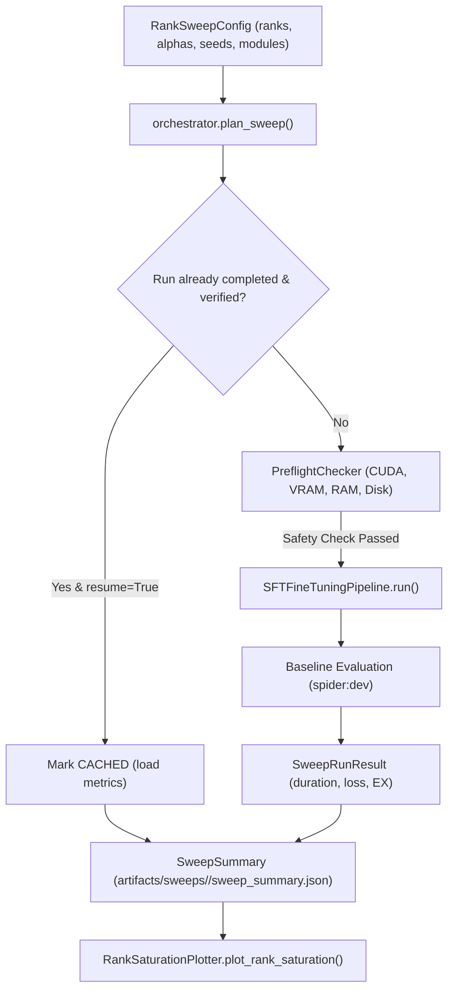

# SQLForge Systematic LoRA Hyperparameter & Rank Scaling Sweeps (EXP-04)

This document formalizes the experimental design, controlled variable isolation, parameter scaling mathematics, hardware prerequisites, artifact schemas, and Pareto frontier analysis for the systematic LoRA rank scaling sweeps implemented in Step 7.

---

## 1. Scientific Objectives & Hypothesis

### Theoretical Context: The Intrinsic Dimension Hypothesis
The Low-Rank Adaptation (LoRA) hypothesis posits that the weight updates $\Delta W$ for pre-trained language models during domain adaptation have a low intrinsic dimension. For domain-specific relational database query synthesis (text-to-SQL), the model must master:
1. Database schema mapping (tables, foreign keys, columns).
2. SQL syntax and clause composition (`SELECT`, `JOIN`, `GROUP BY`, `HAVING`, `WINDOW`).
3. Domain value extraction and filter conditioning.

**EXP-04** tests where execution accuracy (EX) saturates as a function of the intrinsic rank $r$:
$$r \in \{8, 16, 32, 64\}$$
with scaling factor held strictly proportional:
$$\alpha = 2 \times r \quad (\alpha \in \{16, 32, 64, 128\})$$

### Core Research Questions
1. **Saturation Threshold:** Does execution accuracy on `spider:dev` saturate at a low intrinsic dimension ($r=16$ or $r=32$), or does text-to-SQL require higher ranks ($r=64$)?
2. **Compute-Accuracy Pareto Frontier:** What is the marginal execution accuracy gain per million trainable parameters?
3. **Target Module Sensitivity:** How does all-linear projection adaptation (`q, k, v, o, gate, up, down`) compare against attention-only adaptation (`q, k, v, o`) across rank conditions?

---

## 2. Experimental Controls & Invariant Safeguards

To isolate intrinsic rank scaling without confounding variables, all conditions hold the following parameters strictly invariant:

| Controlled Parameter | Invariant Value | Rationale |
| :--- | :--- | :--- |
| **Base Model** | `Qwen/Qwen2.5-Coder-7B-Instruct` | Primary target architecture for open-weight text-to-SQL |
| **Quantization Precision** | 4-bit NormalFloat (`nf4`) | Standardized QLoRA setting (from EXP-03) |
| **Double Quantization** | `True` (`nested_quant=True`) | Constant quantization baseline |
| **Compute Dtype** | `bfloat16` | Dynamic range stability during backward passes |
| **Learning Rate** | $2 \times 10^{-4}$ | Standardized peak learning rate with cosine decay |
| **Warmup Ratio** | $0.03$ (3% steps) | Prevents early gradient divergence |
| **Optimizer** | `paged_adamw_32bit` | Standardized memory-efficient optimizer |
| **Effective Batch Size** | 16 (per-device 8, accumulation 2) | Gradient noise scale held identical |
| **Context Length** | 2048 tokens | Context limit for schema DDL and question tokens |
| **Loss Masking** | Completion-only (`mask_prompt_loss=True`) | Loss computed strictly on target SQL tokens (`-100` label masking) |
| **Training Partition** | `spider:train` ($N = 7,000$ eligible) | Strict isolation; dev/test/held-out splits quarantined |
| **Evaluation Partition**| `spider:dev` ($N = 1,034$) | Standardized cross-database evaluation split |

### Manipulated Variables
1. **LoRA Rank ($r$):** $r \in \{8, 16, 32, 64\}$.
2. **LoRA Alpha ($\alpha$):** $\alpha = 2 \times r$ ($\alpha \in \{16, 32, 64, 128\}$).
3. **Target Modules:** `all-linear` (default) vs. `attention-only`.
4. **Replication Seeds:** Seed 42 for all conditions; top-2 ranks replicated on seeds 43 and 44.

---

## 3. Trainable Parameter Scaling Mathematics

For a linear projection layer $W \in \mathbb{R}^{d_{\text{out}} \times d_{\text{in}}}$, LoRA decomposes the weight update into two low-rank matrices:
$$\Delta W = \frac{\alpha}{r} B A, \quad A \in \mathbb{R}^{r \times d_{\text{in}}}, \quad B \in \mathbb{R}^{d_{\text{out}} \times r}$$
Trainable parameters per adapted linear layer:
$$\text{Params}_{\text{layer}} = r \times (d_{\text{in}} + d_{\text{out}})$$

### Qwen2.5-Coder-7B Architecture Dimensions
- Hidden dimension: $d = 3584$
- Intermediate (FFN) dimension: $d_{\text{ffn}} = 18944$
- Layers: $L = 28$
- Grouped-query attention: $d_{\text{kv}} = 512$ (4 KV heads $\times$ 128 head dim)

#### Attention Projections (per layer)
- $q\_proj$: $2 \times 3584 \times r = 7168 \times r$
- $k\_proj$: $(3584 + 512) \times r = 4096 \times r$
- $v\_proj$: $(3584 + 512) \times r = 4096 \times r$
- $o\_proj$: $2 \times 3584 \times r = 7168 \times r$
- **Total Attention / layer:** $22528 \times r$

#### MLP Projections (per layer)
- $gate\_proj$: $(3584 + 18944) \times r = 22528 \times r$
- $up\_proj$: $(3584 + 18944) \times r = 22528 \times r$
- $down\_proj$: $(18944 + 3584) \times r = 22528 \times r$
- **Total MLP / layer:** $67584 \times r$

#### Total Trainable Parameters (28 layers)
$$\text{Params}_{\text{all-linear}} = 28 \times (22528 + 67584) \times r = 2,523,136 \times r$$

| LoRA Rank ($r$) | LoRA Alpha ($\alpha$) | Trainable Parameters | Fraction of 7B Base | Approx. Adapter Size (16-bit) |
| :---: | :---: | :---: | :---: | :---: |
| **8** | 16 | 20,185,088 | ~0.26% | 38.5 MB |
| **16** (Control) | 32 | 40,370,176 | ~0.53% | 77.0 MB |
| **32** | 64 | 80,740,352 | ~1.06% | 154.0 MB |
| **64** | 128 | 161,480,704 | ~2.12% | 308.0 MB |

---

## 4. Hardware Prerequisites & Feasibility Gates

### Physical Compute Requirements for Empirical Execution
Executing the genuine EXP-04 rank sweep requires:
- **GPU Accelerator:** Single NVIDIA GPU with $\ge 16\text{ GB}$ VRAM (e.g., A10G, L4, or A100).
- **Driver / Runtime:** Linux / WSL2 environment with CUDA $\ge 12.1$ and `bitsandbytes>=0.43.0`.
- **Host Memory:** $\ge 16\text{ GB}$ system RAM.
- **Disk Storage:** $\ge 30\text{ GB}$ free disk space for base weights, checkpoints, and tokenized datasets.
- **Estimated Compute Budget:** ~8 GPU-hours total across all rank conditions and seed replications.

### Preflight Feasibility Gates
`PreflightChecker` audits hardware resources before starting the sweep. If GPU acceleration or dependencies are absent on the host (e.g., on a local CPU-only development machine), the sweep orchestrator:
1. Safely halts before downloading multi-gigabyte weights or attempting backward passes.
2. Allows zero-compute dry runs (`--dry-run`) to validate data formatting, tokenization, and pipeline orchestration.
3. Requires explicit opt-in confirmation (`--execute`) before launching live training on suitable GPU instances.

---

## 5. Sweep Orchestration Architecture & Interrupted-Run Recovery

The sweep orchestration pipeline is implemented in `src/sqlforge/training/sweeps.py`:



### Deterministic Run Identifiers
Every run receives a deterministic, human-readable run identifier:
$$\text{run\_id} = \text{exp04\_r}\{r\}\text{\_a}\{\alpha\}\text{\_}\{\text{target\_modules\_tag}\}\text{\_s}\{\text{seed}\}$$
*Example:* `exp04_r16_a32_all_linear_s42`

### Interrupted-Run Recovery (`resume=True`)
Hyperparameter sweeps across multiple ranks can take hours. If a run is interrupted:
- `plan_sweep()` inspects `artifacts/runs/<run_id>/manifest.json`.
- If a run directory exists and passes cryptographic verification (`tracker.verify_run()`), it is flagged as `CACHED` and skipped.
- New or previously failed runs proceed automatically.
- Collision defense ensures that if rerun with `resume=False`, timestamped non-colliding run IDs are generated to preserve historical records.

---

## 6. Machine-Readable Sweep Artifact Schema (`sweep_summary.json`)

Upon completion, the orchestrator outputs a complete JSON summary:

```json
{
  "sweep_id": "sweep_exp-04-rank-sweep_1791056383",
  "experiment_id": "EXP-04-RANK-SWEEP",
  "base_model_id": "Qwen/Qwen2.5-Coder-7B-Instruct",
  "method": "qlora",
  "total_planned": 4,
  "completed": 4,
  "cached": 0,
  "failed": 0,
  "skipped": 0,
  "is_dry_run": false,
  "results": [
    {
      "run_id": "exp04_r16_a32_all_linear_s42",
      "rank": 16,
      "alpha": 32,
      "target_modules_tag": "all-linear",
      "target_modules": ["q_proj", "k_proj", "v_proj", "o_proj", "gate_proj", "up_proj", "down_proj"],
      "seed": 42,
      "status": "completed",
      "trainable_parameters": 40370176,
      "adapter_size_mb": 77.0,
      "duration_seconds": 1845.2,
      "final_loss": 0.3812,
      "total_steps": 1312,
      "metrics": {
        "execution_accuracy": 0.732,
        "syntax_valid_rate": 0.984,
        "exact_match": 0.612
      },
      "checkpoint_dir": "artifacts/runs/exp04_r16_a32_all_linear_s42",
      "manifest_verified": true
    }
  ],
  "created_at": "2026-10-04T01:10:00Z"
}
```

---

## 7. Pareto Frontier Analysis & Anti-Fabrication Safeguard

The `RankSaturationPlotter` (`src/sqlforge/training/plotting.py`) computes:
1. **Rank Aggregates:** Mean execution accuracy, standard error, and 95% bootstrap confidence intervals across replicated seeds ($S \in \{42, 43, 44\}$).
2. **Pareto Dominance:** A configuration $A$ Pareto-dominates $B$ if:
   $$\text{EX}_A \ge \text{EX}_B \quad \text{and} \quad \text{Params}_A \le \text{Params}_B$$
   (with at least one strict inequality).
3. **Pareto-Optimal Frontier:** The subset of configurations where no other configuration achieves higher execution accuracy with fewer or equal trainable parameters.

### Strict Empirical Plotting Policy
- **No Fabricated Plots:** If a sweep summary contains only dry-run, mock, or unevaluated runs lacking genuine execution accuracy (`metrics["execution_accuracy"]`), `RankSaturationPlotter` immediately raises `NoEmpiricalDataError`.
- **No Mock Placeholders:** The system refuses to generate synthetic or illustrative Pareto curves that could be misinterpreted as empirical findings.
- **Reporting Status:** When genuine GPU runs are pending, the CLI and reports explicitly state:
  `No Empirical Evaluation Data: Plot generation requires genuine execution accuracy measurements on spider:dev. No illustrative or fabricated curves were generated.`

---

## 8. CLI Command Reference

The sweep infrastructure is accessible via the `sqlforge sweep` command group:

```bash
# 1. Plan sweep and inspect cached runs
sqlforge sweep plan --ranks 8,16,32,64 --seeds 42

# 2. Validate controlled invariant variables
sqlforge sweep validate --ranks 8,16,32,64

# 3. Execute zero-compute dry run across all sweep conditions
sqlforge sweep run --ranks 8,16,32,64 --dry-run

# 4. Execute live GPU sweep (requires explicit --execute confirmation)
sqlforge sweep run --ranks 8,16,32,64 --seeds 42,43,44 --execute

# 5. Inspect status of completed or partial sweep
sqlforge sweep status artifacts/sweeps/sweep_exp-04-rank-sweep_1791056383/sweep_summary.json

# 6. Generate Pareto plot and export CSV strictly from empirical results
sqlforge sweep plot --summary-file artifacts/sweeps/sweep_exp-04-rank-sweep_1791056383/sweep_summary.json --output reports/figures/exp04_rank_saturation_pareto.svg --export-csv reports/tables/exp04_rank_sweep_results.csv
```
